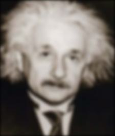
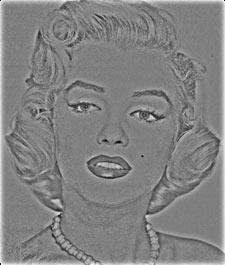
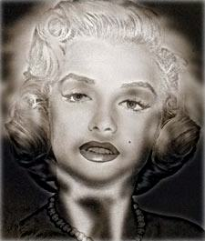

<div align="center">

# 🔧 混合图像生成系统
### Hybrid Image Generation System

[](https://github.com/airprofly/hybridImage) [](https://github.com/airprofly/hybridImage/stargazers) [](https://opensource.org/licenses/MIT)

[](https://www.python.org/downloads/) [](https://pytorch.org/)

[计算机视觉](https://en.wikipedia.org/wiki/Computer_vision) · [图像处理](https://en.wikipedia.org/wiki/Image_processing) · [高斯滤波](https://en.wikipedia.org/wiki/Gaussian_filter) · [混合图像](https://en.wikipedia.org/wiki/Hybrid_image)

</div>

---

## 📖 项目简介

基于高斯滤波的混合图像生成系统，通过合并两张图像的低频和高频分量，实现同一图像在不同观看距离下呈现不同内容的视觉效果。近处观看可见高频图像细节，远处观看可见低频图像轮廓。

本项目提供 NumPy 和 PyTorch 两种实现，并包含性能对比分析。

---

## 📌 功能特性

- ✅ **高斯低通滤波**：使用可配置截止频率的高斯滤波器提取低频分量
- ✅ **高频分量提取**：从第二张图像中减去其低频分量获得高频细节
- ✅ **混合图像合成**：将低频和高频分量合并生成混合图像
- ✅ **双框架实现**：提供 NumPy 和 PyTorch 两种完整实现
- ✅ **性能对比**：内置时间比较脚本，分析两种实现的性能差异
- ✅ **灵活配置**：通过 YAML 配置文件管理图像对和截止频率参数

---

## 📁 项目结构

<details>
<summary><b>查看目录结构</b></summary>

```text
proj1/
├── configs/              # 🔧 配置文件
│   ├── config.py        # 配置数据类定义
│   └── config.yaml      # 项目参数配置
├── data/                # 💾 输入图像数据
│   ├── 1a_dog.bmp
│   ├── 1b_cat.bmp
│   ├── 2a_motorcycle.bmp
│   ├── 2b_bicycle.bmp
│   ├── 3a_plane.bmp
│   ├── 3b_bird.bmp
│   ├── 4a_einstein.bmp
│   ├── 4b_marilyn.bmp
│   ├── 5a_submarine.bmp
│   └── 5b_fish.bmp
├── utils/               # 🔨 工具模块
│   ├── datasets.py      # 数据集类定义
│   ├── model.py         # PyTorch 混合图像模型
│   └── utils.py         # 通用工具函数
├── outputs/             # 📊 输出结果目录（.gitignore）
├── pytorch_main.py      # 🚀 PyTorch 版本主程序
├── numpy_main.py        # 🚀 NumPy 版本主程序
├── time_comparison.py   # ⏱️ 性能对比脚本
├── requirements.txt     # 📄 pip 依赖列表
├── environment.yml      # 📄 Conda 环境配置
└── README.md            # 📝 项目说明
```

</details>

---

## 🔧 环境配置

<details>
<summary><b>查看环境配置</b></summary>

### 前置要求

- 安装 [Miniconda](https://docs.conda.io/en/latest/miniconda.html) 或 [Anaconda](https://www.anaconda.com/)

### 创建虚拟环境

**方法一：使用 environment.yml（推荐）**

```bash
# 从配置文件创建环境
conda env create -f environment.yml

# 激活环境
conda activate pytorch
```

**方法二：手动创建环境**

```bash
# 创建名为 pytorch 的环境
conda create -n pytorch python=3.12

# 激活环境
conda activate pytorch

# 安装依赖
pip install -r requirements.txt
```

</details>

---

## 🚀 快速开始

### 运行 NumPy 版本

```bash
# 确保环境已激活
conda activate pytorch

# 运行 NumPy 实现
python numpy_main.py
```

输出结果将保存至 `outputs/hybrid_numpy/pair_N/` 目录。

### 运行 PyTorch 版本

```bash
# 运行 PyTorch 实现
python pytorch_main.py
```

输出结果将保存至 `outputs/hybrid_pytorch/pair_N/` 目录。

### 性能对比测试

```bash
# 运行性能比较脚本
python time_comparison.py
```

该脚本会对两种实现进行多轮测试，输出平均执行时间和速度对比。

---

## 📚 核心算法原理

<details>
<summary><b>查看算法原理</b></summary>

### 混合图像理论

混合图像（Hybrid Image）利用人类视觉系统的特性：近距离观察时人眼对高频信息更敏感，远距离观察时对低频信息更敏感。通过合并两张图像的不同频率分量，可以创造出具有双重含义的图像。

### 算法流程

1. **低频分量提取**

从第一张图像（Image A）中提取低频分量：

$$
L_A = G_{\sigma} * I_A
$$

其中：
- $L_A$：Image A 的低频分量
- $G_{\sigma}$：标准差为 $\sigma$ 的高斯核
- $*$：卷积运算
- $I_A$：原始 Image A

2. **高频分量提取**

从第二张图像（Image B）中提取高频分量：

$$
H_B = I_B - G_{\sigma} * I_B
$$

其中：
- $H_B$：Image B 的高频分量
- $I_B$：原始 Image B

3. **混合图像合成**

将低频和高频分量合并：

$$
I_{hybrid} = L_A + H_B
$$

### 高斯滤波器

二维高斯函数定义：

$$
G(x, y) = \frac{1}{2\pi\sigma^2} e^{-\frac{x^2 + y^2}{2\sigma^2}}
$$

**截止频率（$\sigma$）的作用**：
- $\sigma$ 越大：保留更多低频信息，图像更模糊
- $\sigma$ 越小：保留更多高频信息，图像细节更丰富

**核大小计算**：

$$
\text{kernel\_size} = 4 \times \sigma + 1
$$

确保核大小为奇数，便于对称填充。

</details>

---

## 🎛️ 参数调优建议

截止频率是影响混合效果的关键参数。以下是本项目 5 对图像的最佳配置：

| 图像对 | 图像 A（低频） | 图像 B（高频） | 推荐截止频率 | 调优说明 |
|--------|---------------|---------------|-------------|----------|
| 1 | 🐕 狗 | 🐱 猫 | 5 | 较高值保留狗的轮廓，猫的细节补充 |
| 2 | 🏍️ 摩托车 | 🚲 自行车 | 3 | 中等值平衡两者轮廓与细节 |
| 3 | ✈️ 飞机 | 🐦 鸟 | 5 | 较高值突出飞机的形状 |
| 4 | 🧠 爱因斯坦 | 👩 玛丽莲·梦露 | 3 | 经典组合，中等值效果最佳 |
| 5 | 🚢 潜艇 | 🐟 鱼 | 4 | 略高值保留潜艇的整体形状 |

### 调优策略

1. **确定低频图像**：选择具有清晰轮廓、形状特征的图像作为低频源（Image A）
2. **确定高频图像**：选择具有丰富纹理、细节的图像作为高频源（Image B）
3. **逐步调整**：
   - 从 $\sigma = 3$ 开始尝试
   - 效果过于模糊 → 减小 $\sigma$
   - 看不到低频轮廓 → 增大 $\sigma$
4. **保存配置**：在 [configs/config.yaml](configs/config.yaml) 中更新 `best_cutoffs` 列表

---

## 📊 效果展示

### 图像混合结果

以 **爱因斯坦 × 玛丽莲·梦露** 为例（经典混合图像组合）：

| 🔵 低频分量（爱因斯坦） | 🟡 高频分量（玛丽莲） | 🟢 混合图像 |
|:---:|:---:|:---:|
|  |  |  |

**观看技巧**：
- **近处观察**：贴近屏幕或放大查看，可见高频图像（玛丽莲）的细节
- **远处观察**：远离屏幕或缩小查看，可见低频图像（爱因斯坦）的轮廓
- **眯眼观察**：眯起眼睛可模拟低通滤波效果

### 性能对比结果

本项目对 NumPy 和 PyTorch 两种实现进行了性能测试，测试环境为 5 对图像，每轮测试 3 次：

| 实现方式 | 平均时间 | 标准差 | 相对性能 |
|---------|---------|--------|---------|
| NumPy | 2.4300 秒 | 0.0619 秒 | 基准 |
| PyTorch | 0.0784 秒 | 0.0656 秒 | **31.0x 更快** |

**结论**：
- 🚀 **PyTorch 实现显著优于 NumPy**，速度提升约 **31 倍**
- 💡 PyTorch 的 GPU 加速能力和优化的卷积运算带来了巨大性能优势
- 📊 标准差分析显示两种实现的稳定性相当，PyTorch 的首轮预热后性能更加稳定

---

## 📄 许可证

本项目采用 [MIT 许可证](https://opensource.org/licenses/MIT)。
